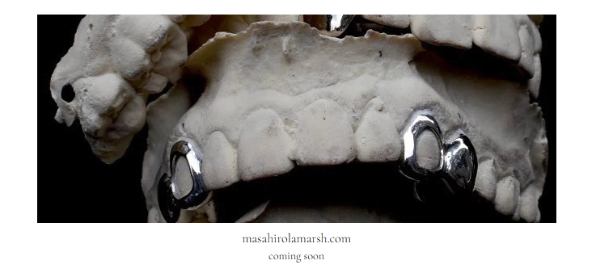

# Hi, I'm vance (mvm) 👋

#### I specialize in building performant, scalable, and maintainable web applications. I also love generative and interactive web art!

- 📍 Brooklyn, NY
- 📷 [instagram.com/insta.mvm/](https://www.instagram.com/insta.mvm/)
- 📧 [root.mvm@gmail.com](mailto:root.mvm@gmail.com)
- 📧 [michael.morrison@mountsinai.org](mailto:michael.morrison@mountsinai.org)

## Currently I'm working on ...

### Light and Health Docs

An open source web application to author, store, and access light and health documentation from the Light and Health Research Center at Mount Sinai.

- Website: [docs.light-health.org](https://docs.light-health.org/)
- GitHub: [/Light-and-Health-Research-Center/docs](https://github.com/Light-and-Health-Research-Center/docs)

### CS Calculator 2.0

An open source web application tool that empowers lighting professionals to select light sources and light levels that will increase the potential for circadian-effective light exposure in architectural spaces, utilizing the CS metric. 

- Website: [cscalc.light-health.org](https://cscalc.light-health.org)
- GitHub: [/Light-and-Health-Research-Center/cscalc](https://github.com/Light-and-Health-Research-Center/cscalc)
- Documentation: [docs.light-health.org/cscalc](https://docs.light-health.org/cscalc)

### Masahiro LaMarsh Corp.

An e-commerce storefront and archive, with a CMS backend for Masahiro LaMarsh, a legendary NYC jeweler.

- Website: [masahirolamarsh.com](https://www.masahirolamarsh.com/)
- GitHub: [/mvvmm/masahirolamarsh.com](https://github.com/mvvmm/masahirolamarsh.com)
- Instagram: [/hirolamarsh](https://www.instagram.com/hirolamarsh)

### Personal Website

Currently working on a live-coding application as part of my website where anyone can edit my generative art code in real time.

- GitHub: [/mvvmm/mvm.dev](https://github.com/mvvmm/mvm.dev)
